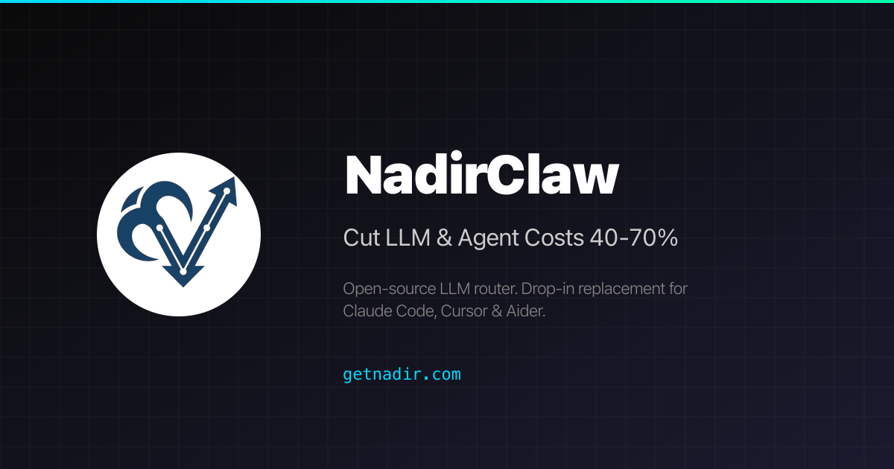
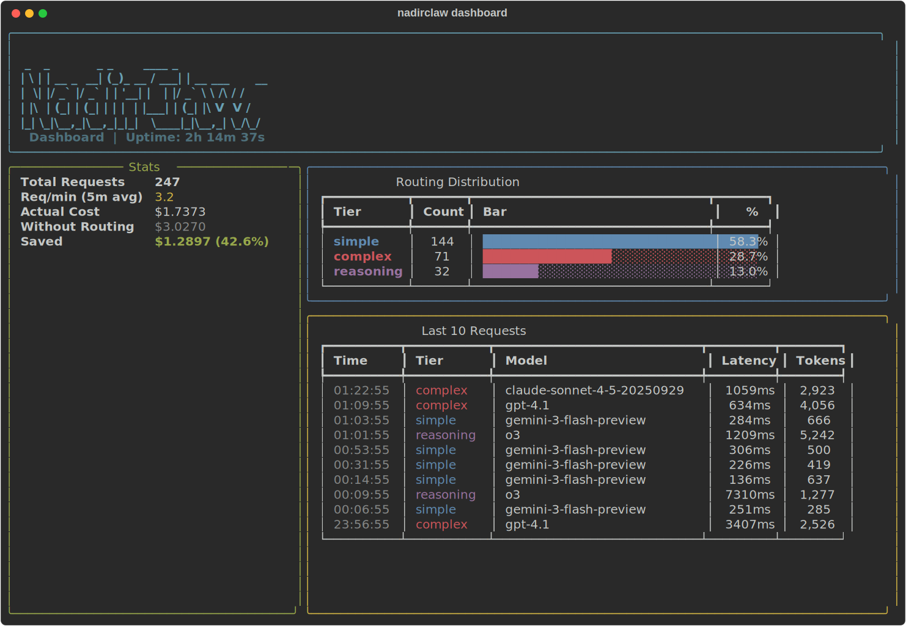

<p align="center">
  <a href="https://getnadir.com">
    
  </a>
</p>

<h1 align="center">NadirClaw</h1>

<p align="center">
  <strong>Your simple prompts are burning premium tokens.</strong><br>
  NadirClaw routes them to cheaper models automatically. Save 40-70% on AI API costs.
</p>

<p align="center">
  <a href="https://pypi.org/project/nadirclaw/"></a>
  <a href="https://github.com/doramirdor/NadirClaw/actions"></a>
  <a href="https://pypi.org/project/nadirclaw/"></a>
  <a href="LICENSE"></a>
  <a href="https://github.com/doramirdor/NadirClaw"></a>
</p>

<p align="center">
  Works with <strong>Claude Code</strong> · <strong>Cursor</strong> · <strong>Continue</strong> · <strong>Aider</strong> · <strong>Windsurf</strong> · <strong>Codex</strong> · <strong>OpenClaw</strong> · <strong>Open WebUI</strong> · Any OpenAI-compatible client
</p>

<p align="center">
  <a href="https://getnadir.com">Website</a> · <a href="#quick-start">Quick Start</a> · <a href="docs/comparison.md">Comparisons</a> · <a href="https://github.com/doramirdor/nadirclaw-action">GitHub Action</a>
</p>

---

## Why NadirClaw?

Most LLM requests don't need a premium model. In typical coding sessions, **60-70% of prompts are simple** — reading files, short questions, formatting. They can be handled by models that cost 10-20x less.

```
$ nadirclaw serve
✓ Classifier ready — Listening on localhost:8856

SIMPLE  "What is 2+2?"              → gemini-flash    $0.0002
SIMPLE  "Format this JSON"          → haiku-4.5       $0.0004
COMPLEX "Refactor auth module..."   → claude-sonnet    $0.098
COMPLEX "Debug race condition..."   → gpt-5.2          $0.450
SIMPLE  "Write a docstring"         → gemini-flash    $0.0002

3 of 5 routed cheaper · $0.549 vs $1.37 all-premium · 60% saved
```

- **Cut AI API costs 40-70%** — real savings from day one
- **~10ms classification overhead** — you won't notice it
- **Drop-in proxy** — works with any OpenAI-compatible tool
- **Runs locally** — your API keys never leave your machine
- **Fallback chains** — automatic failover when models are down
- **Built-in cost tracking** — dashboard, reports, budget alerts

> **Your keys. Your models. No middleman.** NadirClaw runs locally and routes directly to providers. No third-party proxy, no subsidized tokens, no platform that can pull the plug on you. [Why this matters.](docs/vs-clawrouter.md)

## Quick Start

```bash
pip install nadirclaw
```

Or install from source:

```bash
curl -fsSL https://raw.githubusercontent.com/doramirdor/NadirClaw/main/install.sh | sh
```

Then run the interactive setup wizard:

```bash
nadirclaw setup
```

This guides you through selecting providers, entering API keys, and choosing models for each routing tier. Then start the router:

```bash
nadirclaw serve --verbose
```

That's it. NadirClaw starts on `http://localhost:8856` with sensible defaults (Gemini 3 Flash for simple, OpenAI Codex for complex). If you skip `nadirclaw setup`, the `serve` command will offer to run it on first launch.

## Features

- **Smart routing** — classifies prompts in ~10ms using sentence embeddings
- **Three-tier routing** — simple / mid / complex tiers with configurable score thresholds (`NADIRCLAW_TIER_THRESHOLDS`); set `NADIRCLAW_MID_MODEL` for a cost-effective middle tier
- **Agentic task detection** — auto-detects tool use, multi-step loops, and agent system prompts; forces complex model for agentic requests
- **Reasoning detection** — identifies prompts needing chain-of-thought and routes to reasoning-optimized models
- **Vision routing** — auto-detects image content in messages and routes to vision-capable models (GPT-4o, Claude, Gemini)
- **Routing profiles** — `auto`, `eco`, `premium`, `free`, `reasoning` — choose your cost/quality strategy per request
- **Model aliases** — use short names like `sonnet`, `flash`, `gpt4` instead of full model IDs
- **Session persistence** — pins the model for multi-turn conversations so you don't bounce between models mid-thread
- **Context-window filtering** — auto-swaps to a model with a larger context window when your conversation is too long
- **Fallback chains** — if a model fails (429, 5xx, timeout), NadirClaw cascades through a configurable chain of fallback models until one succeeds
- **Streaming support** — full SSE streaming compatible with OpenClaw, Codex, and other streaming clients
- **Native Gemini support** — calls Gemini models directly via the Google GenAI SDK (not through LiteLLM)
- **OAuth login** — use your subscription with `nadirclaw auth <provider> login` (OpenAI, Anthropic, Google), no API key needed
- **Multi-provider** — supports Gemini, OpenAI, Anthropic, Ollama, and any LiteLLM-supported provider
- **OpenAI-compatible API** — drop-in replacement for any tool that speaks the OpenAI chat completions API
- **Request reporting** — `nadirclaw report` with per-model and per-day cost breakdown (`--by-model --by-day`), anomaly flagging, filters, latency stats, tier breakdown, and token usage
- **Log export** — `nadirclaw export --format csv|jsonl --since 7d` for offline analysis in spreadsheets or data tools
- **Raw logging** — optional `--log-raw` flag to capture full request/response content for debugging and replay
- **Prometheus metrics** — built-in `/metrics` endpoint with request counts, latency histograms, token/cost totals, cache hits, and fallback tracking (zero extra dependencies)
- **OpenTelemetry tracing** — optional distributed tracing with GenAI semantic conventions (`pip install nadirclaw[telemetry]`)
- **Cost savings calculator** — `nadirclaw savings` shows exactly how much money you've saved, with monthly projections
- **Spend tracking and budgets** — real-time per-request cost tracking with daily/monthly budget limits, alerts via `nadirclaw budget`, optional webhook and stdout notifications
- **Prompt caching** — in-memory LRU cache for identical chat completions, skipping redundant LLM calls entirely. Configurable TTL and max size via `NADIRCLAW_CACHE_TTL` and `NADIRCLAW_CACHE_MAX_SIZE`. Monitor with `nadirclaw cache` or the `/v1/cache` endpoint
- **Live dashboard** — `nadirclaw dashboard` for terminal, or visit `http://localhost:8856/dashboard` for a web UI with real-time stats, cost tracking, and model usage
- **GitHub Action** — [`doramirdor/nadirclaw-action`](https://github.com/doramirdor/nadirclaw-action) for CI/CD pipelines

## Dashboard

Monitor your routing in real-time with `nadirclaw dashboard`:

<p align="center">
  
</p>

Install the dashboard extras: `pip install nadirclaw[dashboard]`

<p align="center">
  
</p>

## Prerequisites

- **Python 3.10+**
- **git**
- **At least one LLM provider:**
  - [Google Gemini API key](https://aistudio.google.com/apikey) (free tier: 20 req/day)
  - [Ollama](https://ollama.com) running locally (free, no API key needed)
  - [Anthropic API key](https://console.anthropic.com/) for Claude models
  - [OpenAI API key](https://platform.openai.com/) for GPT models
  - Provider subscriptions via OAuth (`nadirclaw auth openai login`, `nadirclaw auth anthropic login`, `nadirclaw auth antigravity login`, `nadirclaw auth gemini login`)
  - Or any provider supported by [LiteLLM](https://docs.litellm.ai/docs/providers)

## Install

### One-line install (recommended)

```bash
curl -fsSL https://raw.githubusercontent.com/doramirdor/NadirClaw/main/install.sh | sh
```

This clones the repo to `~/.nadirclaw`, creates a virtual environment, installs dependencies, and adds `nadirclaw` to your PATH. Run it again to update.

### Manual install

```bash
git clone https://github.com/doramirdor/NadirClaw.git
cd NadirClaw
python3 -m venv venv
source venv/bin/activate
pip install -e .
```

### Uninstall

```bash
rm -rf ~/.nadirclaw
sudo rm -f /usr/local/bin/nadirclaw
```

### Docker

Run NadirClaw + Ollama with zero cost, fully local:

```bash
git clone https://github.com/doramirdor/NadirClaw.git && cd NadirClaw
docker compose up
```

This starts Ollama and NadirClaw on port `8856`. Pull a model once it's running:

```bash
docker compose exec ollama ollama pull llama3.1:8b
```

To use premium models alongside Ollama, create a `.env` file with your API keys and model config (see `.env.example`), then restart.

To run NadirClaw standalone (without Ollama):

```bash
docker build -t nadirclaw .
docker run -p 8856:8856 --env-file .env nadirclaw
```

## Configure

### Environment File

NadirClaw loads configuration from `~/.nadirclaw/.env`. Create or edit this file to set API keys and model preferences:

```bash
# ~/.nadirclaw/.env

# API keys (set the ones you use)
GEMINI_API_KEY=AIza...
OPENAI_API_KEY=sk-...
ANTHROPIC_API_KEY=sk-ant-...

# Model routing
NADIRCLAW_SIMPLE_MODEL=gemini-3-flash-preview
NADIRCLAW_COMPLEX_MODEL=gemini-2.5-pro

# Server
NADIRCLAW_PORT=8856
```

If `~/.nadirclaw/.env` does not exist, NadirClaw falls back to `.env` in the current directory.

### Authentication

NadirClaw supports multiple ways to provide LLM credentials, checked in this order:

1. **OpenClaw stored token** (`~/.openclaw/agents/main/agent/auth-profiles.json`)
2. **NadirClaw stored credential** (`~/.nadirclaw/credentials.json`)
3. **Environment variable** (`GEMINI_API_KEY`, `ANTHROPIC_API_KEY`, `OPENAI_API_KEY`, etc.)

#### Using `nadirclaw auth` (recommended)

```bash
# Add a Gemini API key
nadirclaw auth add --provider google --key AIza...

# Add any provider API key
nadirclaw auth add --provider anthropic --key sk-ant-...
nadirclaw auth add --provider openai --key sk-...

# Login with your OpenAI/ChatGPT subscription (OAuth, no API key needed)
nadirclaw auth openai login

# Login with your Anthropic/Claude subscription (OAuth, no API key needed)
nadirclaw auth anthropic login

# Login with Google Gemini (OAuth, opens browser)
nadirclaw auth gemini login

# Login with Google Antigravity (OAuth, opens browser)
nadirclaw auth antigravity login

# Store a Claude subscription token (from 'claude setup-token') - alternative to OAuth
nadirclaw auth setup-token

# Check what's configured
nadirclaw auth status

# Remove a credential
nadirclaw auth remove google
```

#### Using environment variables

Set API keys in `~/.nadirclaw/.env`:

```bash
GEMINI_API_KEY=AIza...          # or GOOGLE_API_KEY
ANTHROPIC_API_KEY=sk-ant-...
OPENAI_API_KEY=sk-...
```

### Model Configuration

Configure which model handles each tier:

```bash
NADIRCLAW_SIMPLE_MODEL=gemini-3-flash-preview          # cheap/free model
NADIRCLAW_COMPLEX_MODEL=gemini-2.5-pro                 # premium model
NADIRCLAW_REASONING_MODEL=o3                           # reasoning tasks (optional, defaults to complex)
NADIRCLAW_FREE_MODEL=ollama/llama3.1:8b                # free fallback (optional, defaults to simple)
NADIRCLAW_FALLBACK_CHAIN=gpt-4.1,claude-sonnet-4-5-20250929,gemini-2.5-flash  # cascade order on failure (optional)
```

### Example Setups

| Setup | Simple Model | Complex Model | API Keys Needed |
|---|---|---|---|
| **Gemini + Gemini** | `gemini-2.5-flash` | `gemini-2.5-pro` | `GEMINI_API_KEY` |
| **Gemini + Claude** | `gemini-2.5-flash` | `claude-sonnet-4-5-20250929` | `GEMINI_API_KEY` + `ANTHROPIC_API_KEY` |
| **Claude + Ollama** | `ollama/llama3.1:8b` | `claude-sonnet-4-5-20250929` | `ANTHROPIC_API_KEY` |
| **Claude + Claude** | `claude-haiku-4-5-20251001` | `claude-sonnet-4-5-20250929` | `ANTHROPIC_API_KEY` |
| **OpenAI + Ollama** | `ollama/llama3.1:8b` | `gpt-4.1` | `OPENAI_API_KEY` |
| **OpenAI + OpenAI** | `gpt-4.1-mini` | `gpt-4.1` | `OPENAI_API_KEY` |
| **OpenAI Codex** | `gemini-2.5-flash` | `openai-codex/gpt-5.3-codex` | `GEMINI_API_KEY` + OAuth login |
| **Fully local** | `ollama/llama3.1:8b` | `ollama/qwen3:32b` | None |

Gemini models are called natively via the Google GenAI SDK. All other models go through [LiteLLM](https://docs.litellm.ai/docs/providers), which supports 100+ providers.

## Usage with Gemini

Gemini is the default simple model. NadirClaw calls Gemini natively via the Google GenAI SDK for best performance.

```bash
# Set your Gemini API key
nadirclaw auth add --provider google --key AIza...

# Or set in ~/.nadirclaw/.env
echo "GEMINI_API_KEY=AIza..." >> ~/.nadirclaw/.env

# Start the router
nadirclaw serve --verbose
```

### Rate Limit Fallback

If the primary model hits a 429 rate limit, NadirClaw automatically retries once, then falls back to the other tier's model. For example, if `gemini-3-flash-preview` is exhausted, NadirClaw will try `gemini-2.5-pro` (or whatever your complex model is). If both models are rate-limited, it returns a friendly error message instead of crashing.

## Usage with Ollama

If you're running [Ollama](https://ollama.com) locally, NadirClaw works out of the box with no API keys:

```bash
# Fully local setup -- no API keys, no cost
NADIRCLAW_SIMPLE_MODEL=ollama/llama3.1:8b \
NADIRCLAW_COMPLEX_MODEL=ollama/qwen3:32b \
nadirclaw serve --verbose
```

Or mix local + cloud:

```bash
nadirclaw serve \
  --simple-model ollama/llama3.1:8b \
  --complex-model claude-sonnet-4-20250514 \
  --verbose
```

### Recommended Ollama Models

| Model | Size | Good For |
|---|---|---|
| `llama3.1:8b` | 4.7 GB | Simple tier (fast, good enough) |
| `qwen3:32b` | 19 GB | Complex tier (local, no API cost) |
| `qwen3-coder` | 19 GB | Code-heavy complex tier |
| `deepseek-r1:14b` | 9 GB | Reasoning-heavy complex tier |

### Auto-Discovery

NadirClaw can automatically discover Ollama instances on your local network:

```bash
# Quick scan (localhost only)
nadirclaw ollama discover

# Network scan (finds instances on your local subnet)
nadirclaw ollama discover --scan-network
```

The `nadirclaw setup` wizard offers auto-discovery when you select Ollama as a provider, so you don't need to know the URL beforehand. If Ollama is running on a different machine (like a home server or VM), auto-discovery will find it and configure the `OLLAMA_API_BASE` automatically.

Manual configuration is still supported via the `OLLAMA_API_BASE` environment variable:

```bash
# Connect to Ollama on a different host
OLLAMA_API_BASE=http://192.168.1.100:11434 nadirclaw serve
```

## Usage with Custom OpenAI-Compatible Endpoints

NadirClaw works with any OpenAI-compatible API server — vLLM, LocalAI, LM Studio, text-generation-inference, or any custom endpoint:

```bash
# Point NadirClaw at your custom endpoint
NADIRCLAW_API_BASE=http://your-server:8000/v1 \
NADIRCLAW_SIMPLE_MODEL=openai/your-small-model \
NADIRCLAW_COMPLEX_MODEL=openai/your-large-model \
nadirclaw serve --verbose
```

Use the `openai/` prefix on model names so LiteLLM routes them as OpenAI-compatible. `NADIRCLAW_API_BASE` is passed to all non-Ollama, non-Gemini LiteLLM calls.

You can also mix custom endpoints with cloud providers:

```bash
# Local model for simple, cloud for complex
NADIRCLAW_API_BASE=http://localhost:8000/v1 \
NADIRCLAW_SIMPLE_MODEL=openai/local-llama \
NADIRCLAW_COMPLEX_MODEL=claude-sonnet-4-5-20250929 \
nadirclaw serve
```

## Usage with OpenClaw

[OpenClaw](https://openclaw.dev) is a personal AI assistant that bridges messaging services to AI coding agents. NadirClaw integrates as a model provider so OpenClaw's requests are automatically routed to the right model.

### Quick Setup

```bash
# Auto-configure OpenClaw to use NadirClaw
nadirclaw openclaw onboard

# Start the router
nadirclaw serve
```

This writes NadirClaw as a provider in `~/.openclaw/openclaw.json` with model `nadirclaw/auto`. If OpenClaw is already running, it will auto-reload the config -- no restart needed.

### Configure Only (Without Launching)

```bash
nadirclaw openclaw onboard
# Then start NadirClaw separately when ready:
nadirclaw serve
```

### What It Does

`nadirclaw openclaw onboard` adds this to your OpenClaw config:

```json
{
  "models": {
    "providers": {
      "nadirclaw": {
        "baseUrl": "http://localhost:8856/v1",
        "apiKey": "local",
        "api": "openai-completions",
        "models": [{ "id": "auto", "name": "auto" }]
      }
    }
  },
  "agents": {
    "defaults": {
      "model": { "primary": "nadirclaw/auto" }
    }
  }
}
```

NadirClaw supports the SSE streaming format that OpenClaw expects (`stream: true`), handling multi-modal content and tool definitions in system prompts.

## Usage with Codex

[Codex](https://github.com/openai/codex) is OpenAI's CLI coding agent. NadirClaw integrates as a custom model provider.

```bash
# Auto-configure Codex
nadirclaw codex onboard

# Start the router
nadirclaw serve
```

This writes `~/.codex/config.toml`:

```toml
model_provider = "nadirclaw"

[model_providers.nadirclaw]
base_url = "http://localhost:8856/v1"
api_key = "local"
```

### OpenAI Subscription (OAuth)

To use your ChatGPT subscription instead of an API key:

```bash
# Login with your OpenAI account (opens browser)
nadirclaw auth openai login

# NadirClaw will auto-refresh the token when it expires
```

This delegates to the Codex CLI for the OAuth flow and stores the credentials in `~/.nadirclaw/credentials.json`. Tokens are automatically refreshed when they expire.

## Usage with Claude Code

[Claude Code](https://docs.anthropic.com/en/docs/claude-code) is Anthropic's CLI coding agent. NadirClaw works as a drop-in proxy that intercepts Claude Code's API calls and routes simple prompts to cheaper models.

```bash
# Point Claude Code at NadirClaw
export ANTHROPIC_BASE_URL=http://localhost:8856/v1
export ANTHROPIC_API_KEY=local

# Start NadirClaw, then use Claude Code normally
nadirclaw serve --verbose
claude
```

You can also wrap this in a shell alias:

```bash
alias claude-routed='ANTHROPIC_BASE_URL=http://localhost:8856/v1 ANTHROPIC_API_KEY=local claude'
```

### Authentication

Use your existing Claude subscription instead of a separate API key:

```bash
# Login with your Anthropic account (OAuth, opens browser)
nadirclaw auth anthropic login

# Or store a Claude subscription token directly
nadirclaw auth setup-token
```

### What happens

Claude Code sends every request to Anthropic's API. With NadirClaw in front, each prompt is classified in ~10ms:

- Simple prompts (reading files, quick questions, "what does this function do?") get routed to a cheap model like Gemini Flash
- Complex prompts (refactoring, architecture, multi-file changes) stay on Claude

Streaming works as expected. In typical Claude Code usage, 40-70% of prompts are simple enough to route to a cheaper model, which translates directly to cost savings.

## Usage with Open WebUI

[Open WebUI](https://openwebui.com) is a popular self-hosted AI interface. NadirClaw works as a drop-in OpenAI-compatible provider:

```bash
# View setup instructions
nadirclaw openwebui onboard
```

### Quick Setup

1. Start NadirClaw: `nadirclaw serve`
2. In Open WebUI, go to **Admin Settings** → **Connections** → **OpenAI** → **Add Connection**
3. Enter:
   - **URL:** `http://localhost:8856/v1`
   - **API Key:** `local`
4. Select the `auto` model in your chat

Open WebUI will auto-discover NadirClaw's available models (`auto`, `eco`, `premium`, plus your configured tier models). The `auto` model routes each prompt to the right model automatically — simple prompts go to cheap models, complex ones to premium.

## Usage with Continue

[Continue](https://continue.dev) is an open-source AI coding assistant for VS Code and JetBrains. NadirClaw can be added as a model provider:

```bash
# Auto-configure Continue
nadirclaw continue onboard
```

This writes a `~/.continue/config.json` entry with NadirClaw's `auto` model. Just start the server, open Continue in your editor, and select "NadirClaw Auto" from the model dropdown.

## Usage with Cursor

[Cursor](https://cursor.sh) supports OpenAI-compatible providers natively:

```bash
# View setup instructions
nadirclaw cursor onboard
```

In Cursor: **Settings** → **Models** → **OpenAI API Key** → enter `local` as the API key and `http://localhost:8856/v1` as the base URL, with model name `auto`.

## Usage with Any OpenAI-Compatible Tool

NadirClaw exposes a standard OpenAI-compatible API. Point any tool at it:

```bash
# Base URL
http://localhost:8856/v1

# Model
model: "auto"    # or omit -- NadirClaw picks the best model
```

### Example: curl

```bash
curl http://localhost:8856/v1/chat/completions \
  -H "Content-Type: application/json" \
  -d '{
    "messages": [{"role": "user", "content": "What is 2+2?"}]
  }'
```

### Example: curl (streaming)

```bash
curl http://localhost:8856/v1/chat/completions \
  -H "Content-Type: application/json" \
  -d '{
    "messages": [{"role": "user", "content": "What is 2+2?"}],
    "stream": true
  }'
```

### Example: Python (openai SDK)

```python
from openai import OpenAI

client = OpenAI(
    base_url="http://localhost:8856/v1",
    api_key="local",  # NadirClaw doesn't require auth by default
)

response = client.chat.completions.create(
    model="auto",
    messages=[{"role": "user", "content": "What is 2+2?"}],
)
print(response.choices[0].message.content)
```

## Routing Profiles

Choose your routing strategy by setting the model field:

| Profile | Model Field | Strategy | Use Case |
|---|---|---|---|
| **auto** | `auto` or omit | Smart routing (default) | Best overall balance |
| **eco** | `eco` | Always use simple model | Maximum savings |
| **premium** | `premium` | Always use complex model | Best quality |
| **free** | `free` | Use free fallback model | Zero cost |
| **reasoning** | `reasoning` | Use reasoning model | Chain-of-thought tasks |

```bash
# Use profiles via the model field
curl http://localhost:8856/v1/chat/completions \
  -H "Content-Type: application/json" \
  -d '{"model": "eco", "messages": [{"role": "user", "content": "Hello"}]}'

# Also works with nadirclaw/ prefix
# model: "nadirclaw/eco", "nadirclaw/premium", etc.
```

## Model Aliases

Use short names instead of full model IDs:

| Alias | Resolves To |
|---|---|
| `sonnet` | `claude-sonnet-4-5-20250929` |
| `opus` | `claude-opus-4-6-20250918` |
| `haiku` | `claude-haiku-4-5-20251001` |
| `gpt4` | `gpt-4.1` |
| `gpt5` | `gpt-5.2` |
| `flash` | `gemini-2.5-flash` |
| `gemini-pro` | `gemini-2.5-pro` |
| `deepseek` | `deepseek/deepseek-chat` |
| `deepseek-r1` | `deepseek/deepseek-reasoner` |
| `llama` | `ollama/llama3.1:8b` |

```bash
# Use an alias as the model
curl http://localhost:8856/v1/chat/completions \
  -H "Content-Type: application/json" \
  -d '{"model": "sonnet", "messages": [{"role": "user", "content": "Hello"}]}'
```

## Routing Intelligence — How NadirClaw Classifies Prompts

<p align="center">
  
</p>

Beyond basic simple/complex classification, NadirClaw applies routing modifiers that can override the base decision:

### Agentic Task Detection

NadirClaw detects agentic requests (coding agents, multi-step tool use) and forces them to the complex model, even if the individual message looks simple. Signals:

- Tool definitions in the request (`tools` array)
- Tool-role messages (active tool execution loop)
- Assistant→tool→assistant cycles (multi-step execution)
- Agent-like system prompts ("you are a coding agent", "you can execute commands")
- Long system prompts (>500 chars, typical of agent instructions)
- Deep conversations (>10 messages)

This prevents a message like "now add tests" from being routed to the cheap model when it's part of an ongoing agentic refactoring session.

### Reasoning Detection

Prompts with 2+ reasoning markers are routed to the reasoning model (or complex model if no reasoning model is configured):

- "step by step", "think through", "chain of thought"
- "prove that", "derive the", "mathematically show"
- "analyze the tradeoffs", "compare and contrast"
- "critically analyze", "evaluate whether"

### Vision Routing

NadirClaw detects when messages contain images (`image_url` content parts, including base64-encoded images) and automatically routes to a vision-capable model. If the classifier picks a text-only model (e.g., DeepSeek, Ollama), NadirClaw swaps to a vision-capable alternative from your configured tiers.

### Session Persistence

Once a conversation is routed to a model, subsequent messages in the same session reuse that model. This prevents jarring mid-conversation model switches. Sessions are keyed by system prompt + first user message, with a 30-minute TTL.

### Context Window Filtering

If the estimated token count of a request exceeds a model's context window, NadirClaw automatically swaps to a model with a larger context. For example, a 150k-token conversation targeting `gpt-4o` (128k context) will be redirected to `gemini-2.5-pro` (1M context).

## CLI Reference

```bash
nadirclaw setup              # Interactive setup wizard (providers, keys, models)
nadirclaw serve              # Start the router server
nadirclaw serve --log-raw    # Start with full request/response logging
nadirclaw test               # Probe each configured model and verify it responds
nadirclaw classify <prompt>  # Classify a prompt (no server needed)
nadirclaw classify --format json <prompt>  # Machine-readable JSON output
nadirclaw report             # Show a summary report of request logs
nadirclaw report --since 24h # Report for the last 24 hours
nadirclaw report --by-model  # Per-model cost breakdown with anomaly detection
nadirclaw report --by-day    # Per-day cost breakdown
nadirclaw report --by-model --by-day  # Combined model × day breakdown
nadirclaw export --format csv --since 7d  # Export logs to CSV for offline analysis
nadirclaw export --format jsonl -o data.jsonl  # Export to JSONL file
nadirclaw savings            # Show how much money NadirClaw saved you
nadirclaw savings --since 7d # Savings for the last 7 days
nadirclaw dashboard          # Live terminal dashboard with real-time stats
nadirclaw status             # Show config, credentials, and server status
nadirclaw auth add           # Add an API key for any provider
nadirclaw auth status        # Show configured credentials (masked)
nadirclaw auth remove        # Remove a stored credential
nadirclaw auth setup-token      # Store a Claude subscription token (alternative to OAuth)
nadirclaw auth openai login     # Login with OpenAI subscription (OAuth)
nadirclaw auth openai logout    # Remove stored OpenAI OAuth credential
nadirclaw auth anthropic login     # Login with Anthropic/Claude subscription (OAuth)
nadirclaw auth anthropic logout    # Remove stored Anthropic OAuth credential
nadirclaw auth antigravity login   # Login with Google Antigravity (OAuth, opens browser)
nadirclaw auth antigravity logout  # Remove stored Antigravity OAuth credential
nadirclaw auth gemini login       # Login with Google Gemini (OAuth, opens browser)
nadirclaw auth gemini logout      # Remove stored Gemini OAuth credential
nadirclaw codex onboard         # Configure Codex integration
nadirclaw openclaw onboard   # Configure OpenClaw integration
nadirclaw openwebui onboard  # Show Open WebUI setup instructions
nadirclaw continue onboard   # Configure Continue (continue.dev) integration
nadirclaw cursor onboard     # Show Cursor editor setup instructions
nadirclaw build-centroids    # Regenerate centroid vectors from prototypes
```

### `nadirclaw serve`

```bash
nadirclaw serve [OPTIONS]

Options:
  --port INTEGER          Port to listen on (default: 8856)
  --simple-model TEXT     Model for simple prompts
  --complex-model TEXT    Model for complex prompts
  --models TEXT           Comma-separated model list (legacy)
  --token TEXT            Auth token
  --verbose               Enable debug logging
  --log-raw               Log full raw requests and responses to JSONL
```

### `nadirclaw report`

<p align="center">
  
</p>

Analyze request logs and print a summary report:

```bash
nadirclaw report                     # full report
nadirclaw report --since 24h         # last 24 hours
nadirclaw report --since 7d          # last 7 days
nadirclaw report --since 2025-02-01  # since a specific date
nadirclaw report --model gemini      # filter by model name
nadirclaw report --by-model          # per-model cost breakdown
nadirclaw report --by-day            # per-day cost breakdown
nadirclaw report --by-model --by-day # combined breakdown with anomaly detection
nadirclaw report --format json       # machine-readable JSON output
nadirclaw report --export report.txt # save to file
```

Example output:

```
NadirClaw Report
==================================================
Total requests: 147
From: 2026-02-14T08:12:03+00:00
To:   2026-02-14T22:47:19+00:00

Requests by Type
------------------------------
  classify                    12
  completion                 135

Tier Distribution
------------------------------
  complex                    41  (31.1%)
  direct                      8  (6.1%)
  simple                     83  (62.9%)

Model Usage
------------------------------------------------------------
  Model                               Reqs      Tokens
  gemini-3-flash-preview                83       48210
  openai-codex/gpt-5.3-codex           41      127840
  claude-sonnet-4-20250514               8       31500

Latency (ms)
----------------------------------------
  classifier       avg=12  p50=11  p95=24
  total             avg=847  p50=620  p95=2340

Token Usage
------------------------------
  Prompt:         138420
  Completion:      69130
  Total:          207550

  Fallbacks: 3
  Errors: 2
  Streaming requests: 47
  Requests with tools: 18 (54 tools total)
```

### `nadirclaw classify`

Classify a prompt locally without running the server. Useful for testing your setup. Quotes are optional — multi-word prompts work directly:

```bash
$ nadirclaw classify What is 2+2?
Tier:       simple
Confidence: 0.2848
Score:      0.0000
Model:      gemini-3-flash-preview

$ nadirclaw classify Design a distributed system for real-time trading
Tier:       complex
Confidence: 0.1843
Score:      1.0000
Model:      gemini-2.5-pro

# Machine-readable output for scripting
$ nadirclaw classify --format json Refactor this module to use dependency injection
{"tier": "complex", "is_complex": true, "confidence": 0.1612, "score": 0.9056, "model": "gemini-2.5-pro", "prompt": "Refactor this module to use dependency injection"}
```

### `nadirclaw status`

```bash
$ nadirclaw status
NadirClaw Status
----------------------------------------
Simple model:  gemini-3-flash-preview
Complex model: gemini-2.5-pro
Tier config:   explicit (env vars)
Port:          8856
Threshold:     0.06
Log dir:       /Users/you/.nadirclaw/logs
Token:         nadir-***

Server:        RUNNING (ok)
```

### `nadirclaw test`

Verify your credentials and model names before starting the server. Sends a short probe request to each configured tier and reports latency and the model's reply:

```bash
$ nadirclaw test
NadirClaw Model Test
==================================================

  [simple] gemini-2.5-flash
  ──────────────────────────────────────────────
  Status:   OK
  Latency:  312ms
  Reply:    'ok'

  [complex] claude-sonnet-4-5-20250929
  ──────────────────────────────────────────────
  Status:   OK
  Latency:  891ms
  Reply:    'ok'

All models OK. Start the router with: nadirclaw serve
```

Exits with code 1 if any model fails, so it works in CI. Override models inline:

```bash
nadirclaw test --simple-model gemini-2.5-flash --complex-model gpt-4.1
nadirclaw test --timeout 10
```

## How It Works

NadirClaw sits between your application and the LLM provider as a transparent proxy:

```
┌─────────────────┐
│  Your App       │
│  (Claude Code,  │
│   Cursor, etc)  │
└────────┬────────┘
         │ OpenAI API request
         ▼
┌─────────────────┐
│  NadirClaw      │
│  Classifier     │
└────────┬────────┘
         │ Route decision (10ms)
         ▼
┌─────────────────┐
│  LLM Provider   │
│  (Claude, GPT,  │
│   Gemini, etc)  │
└─────────────────┘
```

Most LLM usage doesn't need a premium model. NadirClaw routes each prompt to the right tier automatically:

<p align="center">
  
</p>

### Step-by-Step

1. **Your tool sends a request** to `localhost:8856/v1/chat/completions` (OpenAI format)

2. **NadirClaw intercepts it** and runs the prompt through a lightweight classifier based on sentence embeddings

3. **Routes to the cheapest viable model** based on the classification result and routing modifiers

4. **Forwards the request** to the chosen provider and returns the response

5. **Logs everything** for cost analysis and reporting

Total overhead: ~10ms (classifier inference on a warm encoder)

### The Classifier

NadirClaw uses a binary complexity classifier based on sentence embeddings:

1. **Pre-computed centroids**: Ships two tiny centroid vectors (~1.5 KB each) derived from ~170 seed prompts. These are pre-computed and included in the package — no training step required.

2. **Classification**: For each incoming prompt, computes its embedding using [all-MiniLM-L6-v2](https://huggingface.co/sentence-transformers/all-MiniLM-L6-v2) (~80 MB, downloaded once on first use) and measures cosine similarity to both centroids. If the prompt is closer to the complex centroid, it routes to your complex model; otherwise to your simple model.

3. **Borderline handling**: When confidence is below the threshold (default 0.06), the classifier defaults to complex -- it's cheaper to over-serve a simple prompt than to under-serve a complex one.

4. **Routing modifiers**: After classification, NadirClaw applies intelligent overrides:
   - **Agentic detection** — if tool definitions, tool-role messages, or agent system prompts are detected, forces the complex model
   - **Reasoning detection** — if 2+ reasoning markers are found, routes to the reasoning model
   - **Vision routing** — if image content is detected, swaps to a vision-capable model
   - **Context window check** — if the conversation exceeds the model's context window, swaps to a model that fits
   - **Session persistence** — reuses the same model for follow-up messages in the same conversation

5. **Dispatch**: Calls the selected model via the appropriate backend:
   - **Gemini models** — called natively via the [Google GenAI SDK](https://github.com/googleapis/python-genai) for best performance
   - **All other models** — called via [LiteLLM](https://docs.litellm.ai), which provides a unified interface to 100+ providers

6. **Fallback chains**: If the selected model fails (429 rate limit, 5xx error, or timeout), NadirClaw cascades through a configurable fallback chain. Set `NADIRCLAW_FALLBACK_CHAIN=gpt-4.1,claude-sonnet-4-5-20250929,gemini-2.5-flash` to define the order. Default chain uses all your configured tier models.

7. **Per-model rate limiting**: Protect against runaway costs and provider quota exhaustion with configurable RPM limits per model. When a model hits its limit, NadirClaw automatically triggers the fallback chain — no failed requests. Configure via `NADIRCLAW_MODEL_RATE_LIMITS=gemini-3-flash-preview=30,gpt-4.1=60` or set a blanket default with `NADIRCLAW_DEFAULT_MODEL_RPM=120`. Monitor usage in real-time at `/v1/rate-limits`.

### Why This Works

The key insight: **most prompts don't need the most expensive model.**

In real-world coding assistant usage:
- **60-70%** of prompts work fine on cheap models (Haiku, GPT-4o-mini, Gemini Flash)
- **20-30%** need mid-tier (Sonnet, GPT-4o, Gemini Pro)
- **5-10%** need flagship (Opus, o1, o3)

But without a classifier, everything hits the expensive default. NadirClaw's job is to route smartly without breaking your workflow.

Classification takes ~10ms on a warm encoder. The first request takes ~2-3 seconds to load the embedding model.

## Cost Savings & Benchmarks — How Much Does NadirClaw Save?

Real-world usage shows NadirClaw typically reduces LLM costs by 40-70% depending on your workload and model choices.

### Example: Claude Code Usage

A typical 8-hour coding day with Claude Code (tracked via JSONL session logs):

**Without NadirClaw:**
- Total requests: 147
- All routed to `claude-sonnet-4-5` (premium model)
- Prompt tokens: 138,420
- Completion tokens: 69,130
- Total cost: **$24.18**

**With NadirClaw:**
- Simple tier (62% of requests): 83 requests to `gemini-2.5-flash`
  - Cost: $1.85
- Complex tier (31% of requests): 41 requests to `claude-sonnet-4-5`
  - Cost: $7.32
- Direct (7% of requests): 8 requests (model override, reasoning tasks)
  - Cost: $1.12
- Total cost: **$10.29**

**Savings: $13.89 (57% reduction)**

### Example: OpenClaw Agent

Running an autonomous agent for 24 hours with mixed tasks (file operations, web searches, code generation):

**Without routing:**
- 412 LLM calls to `gpt-4.1`
- Average 850 tokens per call
- Total cost: **$31.45**

**With NadirClaw:**
- Simple tier (68%): 280 calls to `ollama/llama3.1:8b` (local, free)
- Complex tier (32%): 132 calls to `gpt-4.1`
- Total cost: **$11.92**

**Savings: $19.53 (62% reduction)**

### What Gets Routed Where?

Based on 10,000+ production prompts:

**Simple tier (typically 60-70% of requests):**
- "What does this function do?"
- "Read the file at src/main.py"
- "Add a docstring to this class"
- "Show me the last 5 commits"
- "What's the error on line 42?"
- "Continue with that approach"

**Complex tier (30-40% of requests):**
- "Refactor this module to use dependency injection"
- "Design a caching layer for this API"
- "Explain the tradeoffs between these architectures"
- "Debug why this async operation deadlocks"
- Multi-file changes requiring context understanding

**Auto-upgraded to complex:**
- Agentic requests with tool definitions
- Prompts with 2+ reasoning markers
- Requests containing images (vision routing)
- Long conversations (>10 turns)
- Requests exceeding the simple model's context window

### Monthly Projections

If you currently spend $100/month on Claude API:

| Routing Setup | Simple Model | Complex Model | Monthly Cost | Savings |
|---|---|---|---|---|
| No routing | Claude Sonnet | Claude Sonnet | $100.00 | - |
| Conservative | Claude Haiku | Claude Sonnet | $62.00 | 38% |
| Balanced | Gemini Flash | Claude Sonnet | $48.00 | 52% |
| Aggressive | Ollama (free) | Claude Sonnet | $35.00 | 65% |

**Use `nadirclaw report` and `nadirclaw savings` to see your actual numbers.**

## API Endpoints

Auth is disabled by default (local-only). Set `NADIRCLAW_AUTH_TOKEN` to require a bearer token.

| Endpoint | Method | Description |
|---|---|---|
| `/v1/chat/completions` | POST | OpenAI-compatible completions with auto routing (supports `stream: true`) |
| `/v1/classify` | POST | Classify a prompt without calling an LLM |
| `/v1/classify/batch` | POST | Classify multiple prompts at once |
| `/v1/models` | GET | List available models |
| `/v1/rate-limits` | GET | Per-model rate limit status (current RPM, remaining, limits) |
| `/v1/logs` | GET | View recent request logs |
| `/metrics` | GET | Prometheus metrics (request counts, latency histograms, token/cost totals, cache hits, fallbacks) |
| `/health` | GET | Health check (no auth required) |

## Configuration Reference

| Variable | Default | Description |
|---|---|---|
| `NADIRCLAW_SIMPLE_MODEL` | `gemini-3-flash-preview` | Model for simple prompts |
| `NADIRCLAW_COMPLEX_MODEL` | `openai-codex/gpt-5.3-codex` | Model for complex prompts |
| `NADIRCLAW_MID_MODEL` | *(falls back to simple)* | Model for mid-complexity prompts (enables 3-tier routing) |
| `NADIRCLAW_TIER_THRESHOLDS` | `0.35,0.65` | Score thresholds for 3-tier routing: `simple_max,complex_min` |
| `NADIRCLAW_REASONING_MODEL` | *(falls back to complex)* | Model for reasoning tasks |
| `NADIRCLAW_FREE_MODEL` | *(falls back to simple)* | Free fallback model |
| `NADIRCLAW_FALLBACK_CHAIN` | *(all tier models)* | Comma-separated cascade order on model failure |
| `NADIRCLAW_DAILY_BUDGET` | *(none)* | Daily spend limit in USD (e.g. `5.00`) |
| `NADIRCLAW_MONTHLY_BUDGET` | *(none)* | Monthly spend limit in USD (e.g. `50.00`) |
| `NADIRCLAW_BUDGET_WARN_THRESHOLD` | `0.8` | Alert when spend reaches this fraction of budget |
| `NADIRCLAW_BUDGET_WEBHOOK_URL` | *(none)* | Webhook URL — receives POST with JSON alert payload |
| `NADIRCLAW_BUDGET_STDOUT_ALERTS` | `false` | Print alerts to stdout (`true`/`1`/`yes` to enable) |
| `NADIRCLAW_MODEL_RATE_LIMITS` | *(none)* | Per-model RPM limits, e.g. `gemini-3-flash-preview=30,gpt-4.1=60` |
| `NADIRCLAW_DEFAULT_MODEL_RPM` | `0` (unlimited) | Default max requests/minute for any model not in `MODEL_RATE_LIMITS` |
| `NADIRCLAW_AUTH_TOKEN` | *(empty — auth disabled)* | Set to require a bearer token |
| `GEMINI_API_KEY` | -- | Google Gemini API key (also accepts `GOOGLE_API_KEY`) |
| `ANTHROPIC_API_KEY` | -- | Anthropic API key |
| `OPENAI_API_KEY` | -- | OpenAI API key |
| `NADIRCLAW_API_BASE` | *(empty — disabled)* | Custom base URL for OpenAI-compatible endpoints (vLLM, LocalAI, LM Studio, etc.) |
| `OLLAMA_API_BASE` | `http://localhost:11434` | Ollama base URL |
| `NADIRCLAW_CONFIDENCE_THRESHOLD` | `0.06` | Classification threshold (lower = more complex) |
| `NADIRCLAW_PORT` | `8856` | Server port |
| `NADIRCLAW_LOG_DIR` | `~/.nadirclaw/logs` | Log directory |
| `NADIRCLAW_LOG_RAW` | `false` | Log full raw requests and responses (`true`/`false`) |
| `NADIRCLAW_MODELS` | `openai-codex/gpt-5.3-codex,gemini-3-flash-preview` | Legacy model list (fallback if tier vars not set) |
| `OTEL_EXPORTER_OTLP_ENDPOINT` | *(empty — disabled)* | OpenTelemetry collector endpoint (enables tracing) |

## OpenTelemetry (Optional)

NadirClaw supports optional distributed tracing via OpenTelemetry. Install the extras and set an OTLP endpoint:

```bash
pip install nadirclaw[telemetry]

# Export to a local collector (e.g. Jaeger, Grafana Tempo)
OTEL_EXPORTER_OTLP_ENDPOINT=http://localhost:4317 nadirclaw serve
```

When enabled, NadirClaw emits spans for:
- **`smart_route_analysis`** — classifier decision with tier and selected model
- **`dispatch_model`** — individual LLM provider call
- **`chat_completion`** — full request lifecycle

Spans include [GenAI semantic conventions](https://opentelemetry.io/docs/specs/semconv/gen-ai/) (`gen_ai.request.model`, `gen_ai.usage.input_tokens`, `gen_ai.usage.output_tokens`) plus custom `nadirclaw.*` attributes for routing metadata.

If the telemetry packages are not installed or `OTEL_EXPORTER_OTLP_ENDPOINT` is not set, all tracing is a no-op with zero overhead.

## Prometheus Metrics

NadirClaw exposes a built-in `/metrics` endpoint in Prometheus text exposition format. No extra dependencies required.

```bash
curl http://localhost:8856/metrics
```

Available metrics:

| Metric | Type | Labels | Description |
|---|---|---|---|
| `nadirclaw_requests_total` | counter | model, tier, status | Total completed LLM requests |
| `nadirclaw_tokens_prompt_total` | counter | model | Total prompt tokens consumed |
| `nadirclaw_tokens_completion_total` | counter | model | Total completion tokens generated |
| `nadirclaw_cost_dollars_total` | counter | model | Estimated cost in USD |
| `nadirclaw_request_latency_ms` | histogram | model, tier | Request latency in milliseconds |
| `nadirclaw_cache_hits_total` | counter | — | Prompt cache hits |
| `nadirclaw_fallbacks_total` | counter | from_model, to_model | Fallback events |
| `nadirclaw_errors_total` | counter | model, error_type | Request errors |
| `nadirclaw_uptime_seconds` | gauge | — | Seconds since server start |

Add to your `prometheus.yml`:

```yaml
scrape_configs:
  - job_name: nadirclaw
    static_configs:
      - targets: ["localhost:8856"]
```

## Project Structure

```
nadirclaw/
  __init__.py        # Package version
  cli.py             # CLI commands (setup, serve, classify, report, status, auth, codex, openclaw)
  setup.py           # Interactive setup wizard (provider selection, credentials, model config)
  server.py          # FastAPI server with OpenAI-compatible API + streaming
  classifier.py      # Binary complexity classifier (sentence embeddings)
  credentials.py     # Credential storage, resolution chain, and OAuth token refresh
  encoder.py         # Shared SentenceTransformer singleton
  oauth.py           # OAuth login flows (OpenAI, Anthropic, Gemini, Antigravity)
  routing.py         # Routing intelligence (agentic, reasoning, vision, profiles, aliases, sessions)
  report.py          # Log parsing and report generation
  metrics.py         # Built-in Prometheus metrics (zero dependencies)
  rate_limit.py      # Per-model rate limiting (sliding window, env-configurable)
  telemetry.py       # Optional OpenTelemetry integration (no-op without packages)
  auth.py            # Bearer token / API key authentication
  settings.py        # Environment-based configuration (reads ~/.nadirclaw/.env)
  prototypes.py      # Seed prompts for centroid generation
  simple_centroid.npy   # Pre-computed simple centroid vector
  complex_centroid.npy  # Pre-computed complex centroid vector
```

## License

MIT
